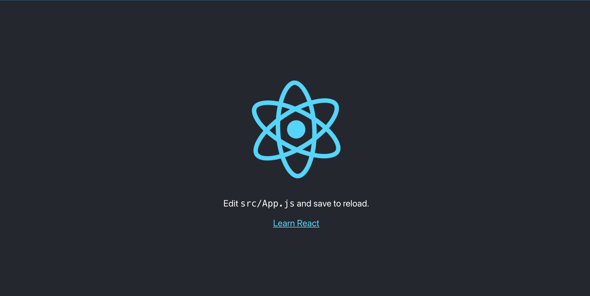

# Create React App

是一個自動化建立一個簡單的 React 的工具

利用這個工具產生一個靜態的檔案

再利用 docker 打包成 Image 

並且以 container 跑起來 可以利用網頁瀏覽器瀏覽

## Initial React Project

```
  $ npx create-react-app lke-example
  $ cd lke-example
  $ npm install
  $ npm start
```



## Dockerfile

Dockerfile
```Dockerfile
FROM node:18.0-slim as Frontend

WORKDIR /app
COPY . /app

RUN npm install
RUN npm run build

FROM nginx:stable-alpine
RUN mv /usr/share/nginx/html/index.html /usr/share/nginx/html/old-index.html
COPY --from=Frontend /app/build/ /usr/share/nginx/html/

EXPOSE 80
```

昨天有解釋一些參數

今天又多了一些新的參數

`FROM node:18.0-slim as Frontend`

這一個 image 基於 `node:18.0-slim` 產生後命名為 `Frontend`

`COPY --from=Frontend /app/build/ /usr/share/nginx/html/`

將 `Frontend` 的 image 複製 `/app/build/` 的檔案到 Nginx 的 `/usr/share/nginx/html/`

## Build Image

```
  $ docker build -t lke-example .
```

成功後會有多一個 lke-example 的 image

## Run a Container From lke-example

```
  $ docker run -p 8080:80 -d lke-example
```

[localhost](http://localhost:8080)

這時候就可以看到頁面

## Push 到 Docker Hub

```
  $ docker login # 登入
  $ docker push lke-example ## 這時候可能會錯誤 
```

### Trouble shotting

`denied: requested access to the resource is denied`

如果看到這個錯誤

要給予這個 image 一個 tag

```
  $ docker tag lke-example ${docker hub name}/lke-example:v1.0.0
```

之後再做 push 就可以了

推上去之後

明天再來處理 deploy 到 k8s 上
